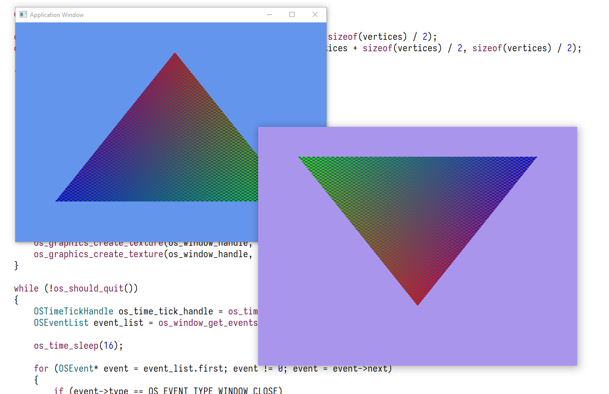

# Application
Platform abstraction for building graphics applications. (Windows only for now.)

## Features
- Window operations
  - Create/close window
  - Multiple windows support
  - Window input events
  - Borderless window option
  - Draw to window
- I/O operations
  - Write to console
  - Open/create file
  - Read/write to file
- Memory operations
  - Reserve/commit/decommit from virtual address space
  - Heap allocate/release
  - Memory arena support
- Time operations
  - Local/system time
  - Sleep
  - Tick/frequency
  - ~~Timer support~~
- Threads
  - Create/suspend thread
  - Helper functions for waiting threads
- Atomics
  - Primitive atomic operations (add, increase, exchange, compare-exchange etc.)
  - Acquire/release semantics
- Logging
  - Wait-free logging support
  - 5 different log level
  - Log filter
  - ~~Callback for logs~~
- Graphics (D3D11)
  - Vertex shader
  - Pixel shader
  - Textures
  - Default pipeline for putting pixels to windows
  - ~~Compile shaders~~

## Media

